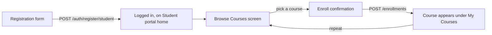
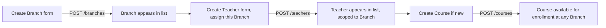
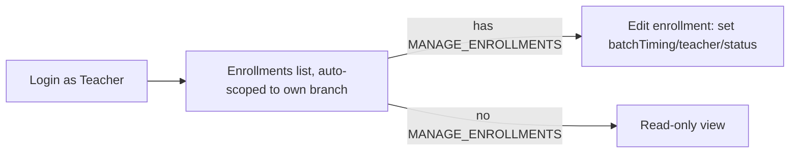

# Viva Academy — Product & UI Specification

This document is written to be handed to an AI (or a human) building the **frontend** for Viva
Academy. It describes the product from a screens-and-flows point of view: who logs in, what they
see, what data each screen needs, and which API endpoint backs each action. The backend that
implements this contract already exists (Fastify + MongoDB); see
[`TECHNICAL_FLOW.md`](./TECHNICAL_FLOW.md) if you need backend implementation details — this file
intentionally leaves those out and focuses on what the UI needs to know.

## 1. What the app is

Viva Academy is a multi-branch institution offering several courses — **Yoga**, **Dance**,
**Music**, **Abacus**, **10th Tuition**, **Hindi Classes** (and a generic `OTHER` category for
future additions). Each branch (physical location) has its own students and teachers; a teacher
can be assigned to more than one branch; a student can enroll in multiple courses at once.

Build a single web app with **three experiences behind one login screen**: Super Admin console,
Teacher console, Student portal. Which one a user sees is driven entirely by their role and (for
teachers) their permissions — **fetch `GET /api/menus` after login and render navigation from its
response** rather than hardcoding menus per role in the frontend.

## 2. Roles at a glance

| Role | Who | What they see |
| --- | --- | --- |
| `SUPER_ADMIN` | Institution owner/ops | Full console: branches, courses, teachers, students, enrollments, reports, no restrictions |
| `TEACHER` | Staff at one or more branches | Subset of the console, scoped to their own branch(es); exact sections depend on their permissions (see §3) |
| `STUDENT` | Learner | Simplified portal: their profile, their courses, enrolling in new courses |

### Teacher permissions (drive which teacher screens/buttons are visible)

A teacher's `designation` seeds a default permission set; a Super Admin can customize permissions
per teacher. Build the UI to check permissions, not designation directly — designation is really
just "why they have these permissions."

| Permission | Unlocks in the UI |
| --- | --- |
| `VIEW_STUDENTS` | "Students" section (read-only) |
| `MANAGE_STUDENTS` | Edit/deactivate actions on Students |
| `VIEW_ENROLLMENTS` | "Enrollments" section (read-only) |
| `MANAGE_ENROLLMENTS` | Create/edit/cancel actions on Enrollments |
| `VIEW_REPORTS` | "Reports" section |
| `MANAGE_COURSE_CONTENT` | Create/edit courses |
| `MANAGE_BRANCH_TEACHERS` | Edit colleague teachers at a shared branch |

Designations, for reference (`INSTRUCTOR` → `SENIOR_INSTRUCTOR` → `COORDINATOR` → `ACADEMIC_HEAD`)
each add more of the permissions above — but always render based on the `permissions` array
returned by the API, since a Super Admin may customize an individual teacher's permissions away
from their designation's defaults.

## 3. Navigation

Call `GET /api/menus` (authenticated) and render the returned tree as the primary nav. Each item
looks like:

```json
{ "key": "courses", "label": "Courses", "path": "/courses", "icon": "book", "children": [ ... ] }
```

Use `icon` as a hint for an icon set (e.g. Lucide) — treat unknown icon names gracefully (fallback
icon). The tree is already filtered server-side to what the logged-in user may see, so **the
frontend does not need its own role/permission-gating logic for menu visibility** — it still needs
gating for in-page buttons (e.g. an "Edit" button on a Students list), described per screen below.

Baseline sections that appear across roles, for context on what the full nav can contain:
Dashboard, Branches (admin only), Courses, Teachers, Students, Enrollments (staff) / My Courses
(students), Reports (permission-gated), My Profile, Settings.

## 4. Screens

For each screen: purpose, who can reach it, the data it needs, and the actions available.

### 4.1 Login

- Single form: email + password. `POST /api/auth/login` → `{ user, accessToken, refreshToken }`.
- Store both tokens; attach `Authorization: Bearer <accessToken>` to all subsequent calls.
- On `401` from any call, try `POST /api/auth/refresh` with the stored refresh token once; if that
  also fails, force logout back to this screen.
- After login, redirect based on `user.role`: `SUPER_ADMIN`/`TEACHER` → admin console dashboard,
  `STUDENT` → student portal home.
- Also provide a **student self-registration** form (name, email, password, phone, branch picker,
  optional DOB/gender/address/guardian name+phone) → `POST /api/auth/register/student`. This is
  the only account type that self-registers; teachers and the super admin are created by an admin.

### 4.2 Dashboard (role-aware landing page)

- Super Admin: counts/tiles for branches, active teachers, active students, active enrollments;
  quick links to create a branch/course/teacher.
- Teacher: counts scoped to their own branch(es) — students, active enrollments, upcoming batches.
- Student: their active enrollments as cards (course name, batch timing, teacher name), a
  "Browse courses" call to action.
- No dedicated endpoint for this — compose it from `GET /api/branches`, `GET /api/students`,
  `GET /api/enrollments` etc. as needed, or treat it as a v2 concern and start with a simple
  welcome + shortcuts screen if time is tight.

### 4.3 Branches — Super Admin only

- **List**: table of all branches — columns `name`, `code`, `city`, `phone`, `isActive`. Source:
  `GET /api/branches`.
- **Detail/Edit**: form with `name`, `code`, `address`, `city`, `state`, `phone`, `email`. Save via
  `PATCH /api/branches/:id`.
- **Create**: same fields, `POST /api/branches`.
- **Deactivate**: action button, `DELETE /api/branches/:id` (soft-deactivates, doesn't hard-delete
  — reflect this as "Deactivate", not "Delete", in the UI copy).

### 4.4 Courses — visible to everyone, editable by admins/permitted teachers

- **List**: table/grid of courses — `name`, `category` (badge), `fee`, `durationMonths`,
  `isActive`. Filterable by `category`. Source: `GET /api/courses?category=...`.
- **Detail**: `name`, `category`, `description`, `durationMonths`, `fee`.
- **Create/Edit** (only if `SUPER_ADMIN` or teacher has `MANAGE_COURSE_CONTENT`): same fields via
  `POST /api/courses` / `PATCH /api/courses/:id`.
- **Deactivate** (Super Admin only): `DELETE /api/courses/:id`.
- Category values to render as a fixed dropdown/badge set: `YOGA`, `DANCE`, `MUSIC`, `ABACUS`,
  `TUITION_10TH`, `HINDI_CLASSES`, `OTHER`.

### 4.5 Teachers — Super Admin and Teachers

- **List**: `name`, `email`, `designation` (badge), `branches` (chips), `specializedCourses`
  (chips). Filterable by `branch`. Source: `GET /api/teachers?branch=...`.
- **Detail**: everything above plus `phone`, `permissions` (chips), `joiningDate`, `isActive`.
- **Create** (Super Admin only): `name`, `email`, `password`, `phone`, `designation` (dropdown:
  `INSTRUCTOR` / `SENIOR_INSTRUCTOR` / `COORDINATOR` / `ACADEMIC_HEAD`), `branches` (multi-select,
  required, at least one), `specializedCourses` (multi-select, optional), `joiningDate`.
  `POST /api/teachers`.
- **Edit**: Super Admin can edit anything, including `permissions` directly (multi-select of the
  7 permission values) and `designation`. A teacher with `MANAGE_BRANCH_TEACHERS` can edit a
  colleague **only if they share a branch**, and cannot change that colleague's `designation` or
  `permissions` — hide those two fields in the form when the editor is a teacher, not an admin.
  `PATCH /api/teachers/:id`.
- **Deactivate** (Super Admin only): `DELETE /api/teachers/:id`.

### 4.6 Students — Super Admin and Teachers (with `VIEW_STUDENTS`)

- **List**: `name`, `email`, `phone`, `branch`, `isActive`. Filterable by `branch` — for a teacher
  this defaults to their own branch(es), no branch picker needed unless they manage more than one.
  Source: `GET /api/students?branch=...`.
- **Detail**: adds `dateOfBirth`, `gender`, `address`, `guardianName`, `guardianPhone`.
- **Edit** (needs `MANAGE_STUDENTS` for teachers; Super Admin unrestricted): same fields, plus
  `branch` (Super Admin/qualifying teacher only — moving a student to a branch the teacher doesn't
  manage should be blocked; surface the API's error message if it happens).
  `PATCH /api/students/:id`.
- **Deactivate** (needs `MANAGE_STUDENTS`): `DELETE /api/students/:id`.
- A student can also reach a **cut-down version of their own detail/edit screen** — see §4.8 "My
  Profile" — via `GET /api/me` and `PATCH /api/students/:id` (their own id), but without `branch`
  or `isActive` in the form.

### 4.7 Enrollments — Super Admin, Teachers (with view/manage permissions), and Students (their own)

- **List**: `student` (name), `course` (name), `branch`, `teacher` (name), `batchTiming`,
  `status` (badge: `ACTIVE` green / `COMPLETED` blue / `CANCELLED` grey), `startDate`, `feePaid`.
  Filterable by `student`, `branch`, `status`. Source: `GET /api/enrollments?...` — the API
  already scopes results (a student only ever gets their own; a teacher only their branch's).
- **Create** ("Enroll"):
  - Student flow: pick a `course` from the active course list; `branch` is fixed to their own
    registered branch (don't show a picker); optional `batchTiming`. `POST /api/enrollments`
    (omit `student` — the API infers it's the caller).
  - Teacher/Admin flow: pick `student`, `course`, `branch`, optional `teacher` (batch instructor)
    and `batchTiming`. Same endpoint, `student` required in the payload.
  - Handle the "already has an active enrollment in this course" error from the API by showing an
    inline message rather than a generic failure toast.
- **Edit** (Teacher with `MANAGE_ENROLLMENTS`, or Super Admin): `teacher`, `batchTiming`,
  `endDate`, `status`, `feePaid`. `PATCH /api/enrollments/:id`.
- **Cancel**: available to the enrolled student themselves, a permitted teacher, or admin — sets
  status to `CANCELLED`. `DELETE /api/enrollments/:id`. Label the button "Cancel enrollment", not
  "Delete" — the record is kept for history.

### 4.8 My Profile — everyone

- `GET /api/me` for the current user's full record (already populated with branch/branches/
  specializedCourses as applicable).
- Editable fields differ by role:
  - Student: `name`, `phone`, `address`, `guardianName`, `guardianPhone`. (Not `branch` — that's
    admin/teacher controlled.)
  - Teacher/Super Admin: `name`, `phone` via `PATCH /api/teachers/:id` (self) or a Super Admin
    editing their own record — treat as the same "Edit teacher/self" form as §4.5 for teachers.
- **Change password**: current + new password form, `POST /api/auth/change-password`.

### 4.9 Reports — Super Admin and Teachers with `VIEW_REPORTS`

- No dedicated report endpoint yet; compose simple views from `GET /api/enrollments` and
  `GET /api/students` scoped by branch (e.g. enrollment counts per course, active vs. cancelled
  ratios). Treat this screen as a lightweight placeholder/first version — flag it as an area the
  backend will likely grow dedicated endpoints for later.

### 4.10 Settings — everyone

- Change password (same as §4.8) plus any client-side preferences (theme, etc.) you choose to add;
  nothing else is backend-required here today.

## 5. Data dictionary (for building forms & tables)

**Branch** — `name`, `code`, `address`, `city`, `state?`, `phone?`, `email?`, `isActive`

**Course** — `name`, `category` (enum above), `description?`, `durationMonths?` (number, months),
`fee` (number), `isActive`

**Student** — `name`, `email`, `phone?`, `branch` (ref → Branch), `dateOfBirth?`,
`gender?` (`MALE`/`FEMALE`/`OTHER`), `address?`, `guardianName?`, `guardianPhone?`, `isActive`

**Teacher** — `name`, `email`, `phone?`, `designation` (enum above), `branches` (ref[] → Branch,
at least 1), `specializedCourses?` (ref[] → Course), `permissions` (enum[] above), `joiningDate?`,
`isActive`

**Enrollment** — `student` (ref → Student), `course` (ref → Course), `branch` (ref → Branch),
`teacher?` (ref → Teacher), `batchTiming?` (free text, e.g. "Mon/Wed/Fri 5–6 PM"), `startDate`,
`endDate?`, `status` (`ACTIVE`/`COMPLETED`/`CANCELLED`), `feePaid` (number)

All list endpoints return the raw arrays wrapped in a named key (e.g. `{ "students": [...] }`,
`{ "enrollments": [...] }`) — match each screen's fetch to that shape.

## 6. Key user journeys (for wizard-style or multi-step screens)

### 6.1 Student joins and enrolls



### 6.2 Admin sets up a new branch with staff



### 6.3 Teacher manages their branch's enrollments



## 7. States & empty states to design for

- `isActive: false` records should generally be hidden from default list views but visible via a
  "Show inactive" toggle — the API returns them from `GET` list endpoints too (it only filters on
  explicit query params), so the frontend controls this, not the backend.
- Empty states: no branches yet (admin), no courses yet, "you have no active enrollments — browse
  courses" (student), "no students in your branch yet" (teacher).
- Error states worth explicit handling: 401 (redirect to login), 403 (friendly "you don't have
  access to this" rather than a raw error), 409 (duplicate enrollment / duplicate branch code /
  duplicate email — show inline on the relevant field).

## 8. Business rules the UI should respect

- One branch per student; many branches per teacher; many courses per student (via enrollments);
  many specialized courses per teacher.
- A student cannot hold two simultaneously **ACTIVE** enrollments in the same course — the API
  enforces this, but pre-empt it in the UI by disabling "Enroll" on a course the student is
  already actively enrolled in.
- Teachers only ever act within their own branch(es) — don't render branch pickers with the full
  branch list for a teacher; scope to `branches` from their own `GET /api/me` response.
- A teacher's visible actions are governed by their `permissions`, not just their role — always
  check permissions from the API response, never assume by designation name.
- Super Admin bypasses all branch/permission scoping — every action is available to them.
- Deactivation is soft everywhere — label destructive-looking buttons "Deactivate"/"Cancel", never
  "Delete", and don't remove the record from the UI's data model, just its active-state styling.
