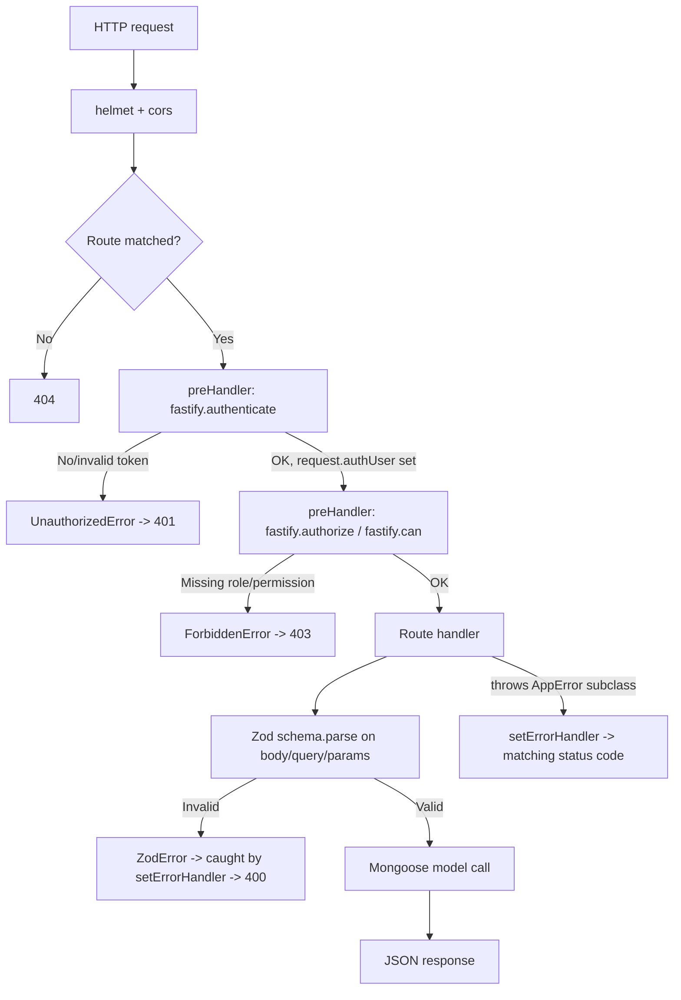
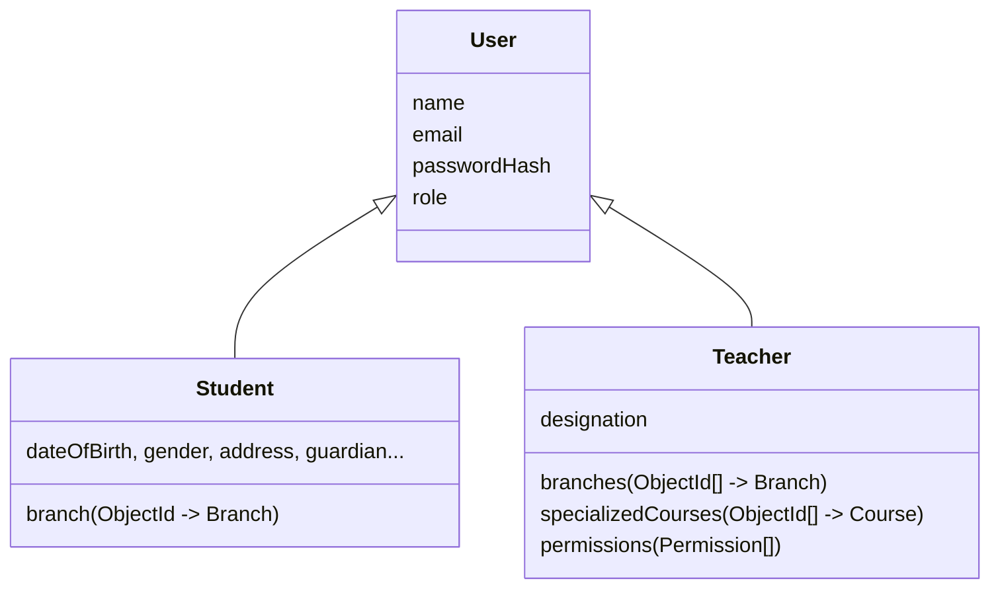
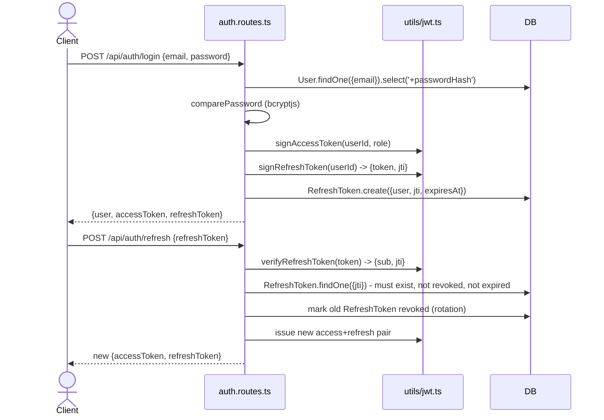

# Viva Academy — Technical Flow

This document explains **how the code implements** the domain described in
[`DOMAIN_FLOW.md`](./DOMAIN_FLOW.md): the stack, the folder structure, and how a request travels
through the system.

## 1. Stack

| Concern | Choice |
| --- | --- |
| Language | TypeScript (strict mode) |
| HTTP framework | [Fastify](https://fastify.dev/) |
| Database | MongoDB via [Mongoose](https://mongoosejs.com/) |
| Auth | Hand-rolled JWT (`jsonwebtoken`) — short-lived access token + rotating refresh token |
| Validation | [Zod](https://zod.dev/) schemas, parsed inside route handlers |
| Password hashing | `bcryptjs` |

## 2. Folder structure

```
src/
  config/       env loading (env.ts), DB connection (db.ts), static menu tree (menu.ts)
  types/        shared enums (UserRole, Permission, ...) + AuthUser/JWT payload types
  models/       Mongoose schemas/models
  schemas/      Zod request-validation schemas, one file per module
  utils/        jwt signing/verification, password hashing, AppError hierarchy, branch-access helper
  plugins/      auth.ts — the Fastify plugin that adds authenticate/authorize/can
  modules/      one folder per resource; each has a *.routes.ts (and menu also has a *.service.ts)
  app.ts        builds and wires the Fastify instance (plugins, routes, error handler)
  server.ts     entrypoint — connects to Mongo, starts listening, handles shutdown signals
  scripts/      seedSuperAdmin.ts — one-off script to create the first SUPER_ADMIN account
```

Each `modules/<name>/<name>.routes.ts` file owns its own Fastify routes and, for anything beyond
trivial CRUD, does the DB calls and permission checks directly (no extra service-layer
indirection) — the project intentionally keeps one file per resource rather than
routes/services/controllers split three ways, since the logic per resource is small enough to
read in one place.

## 3. Request lifecycle



This pipeline is assembled in [`app.ts`](../src/app.ts):

1. `@fastify/helmet` and `@fastify/cors` are registered first.
2. `authPlugin` (see below) decorates the Fastify instance with `authenticate`, `authorize`, and
   `can` — these are used as `preHandler` hooks, either per-route or via `fastify.addHook` at the
   top of a module's route file so *every* route in that module requires login.
3. Each module is registered under an `/api/<resource>` prefix.
4. A single `setErrorHandler` at the bottom translates thrown errors into HTTP responses (see
   §6).

## 4. Data layer: models & discriminators

Students, Teachers and the Super Admin are all "users" that log in the same way, but carry very
different fields. Rather than one bloated schema with lots of optional fields, the base
[`User`](../src/models/User.ts) model uses **Mongoose discriminators**:



- [`Student`](../src/models/Student.ts) and [`Teacher`](../src/models/Teacher.ts) both call
  `User.discriminator(role, schema)`, so they share the same MongoDB collection (`users`) but get
  their own extra fields and their own Mongoose model class. Querying `User.findById(...)`
  automatically returns a document already cast to the right subclass based on its stored `role`.
- A `SUPER_ADMIN` has no extra fields, so it's just a plain `User` document with
  `role: 'SUPER_ADMIN'` — no discriminator needed.
- [`Teacher`](../src/models/Teacher.ts) has a `pre('validate')` hook: if `permissions` isn't
  explicitly set when a teacher is created, it's seeded from
  `DESIGNATION_PERMISSIONS[designation]` (defined in [`types/index.ts`](../src/types/index.ts)).
- [`Enrollment`](../src/models/Enrollment.ts) has a **partial unique index** on
  `{ student, course }` scoped to `status: 'ACTIVE'` — this is what enforces "no two simultaneous
  active enrollments in the same course" at the database level, not just in application code.
- [`RefreshToken`](../src/models/RefreshToken.ts) has a TTL index (`expireAfterSeconds: 0` on
  `expiresAt`) so MongoDB automatically deletes expired refresh-token records.

## 5. Auth & RBAC

### 5.1 Token issuance (login / register / refresh)



Two separate secrets (`JWT_ACCESS_SECRET`, `JWT_REFRESH_SECRET`) and expiries
(`JWT_ACCESS_EXPIRES_IN` = 15m, `JWT_REFRESH_EXPIRES_IN` = 30d by default) are used so a leaked
access token has a short blast radius, while the refresh token is rotated (old one revoked, new
one issued) on every use and can be explicitly revoked via `POST /api/auth/logout`.

### 5.2 The auth plugin

[`plugins/auth.ts`](../src/plugins/auth.ts) decorates the Fastify instance with three functions,
used as `preHandler`s:

- **`authenticate`** — reads the `Authorization: Bearer <token>` header, verifies the access
  token, loads the `User` from the DB, and attaches a normalized `AuthUser` object to
  `request.authUser` (`{ id, role, email, permissions, branches }`). Loading from the DB on every
  request — rather than trusting the JWT's claims — means a permission/branch change or account
  deactivation takes effect immediately, not just after the token expires.
- **`authorize(...roles)`** — returns a `preHandler` that 403s unless `request.authUser.role` is
  in the given list. `SUPER_ADMIN` always passes, regardless of the list.
- **`can(...permissions)`** — returns a `preHandler` that 403s unless the caller is a `TEACHER`
  holding *all* the listed permissions (again, `SUPER_ADMIN` always passes).

These compose in a route's options, e.g. in
[`course.routes.ts`](../src/modules/courses/course.routes.ts):

```ts
fastify.post(
  '/',
  { preHandler: [fastify.authorize(UserRole.SUPER_ADMIN, UserRole.TEACHER), fastify.can(Permission.MANAGE_COURSE_CONTENT)] },
  async (request, reply) => { /* ... */ },
);
```

### 5.3 Branch scoping

Role and permission checks alone aren't enough — a `TEACHER` with `MANAGE_STUDENTS` should only
manage students **at their own branch(es)**, not the whole institution. That's what
[`assertBranchAccess`](../src/utils/authHelpers.ts) is for: it throws `ForbiddenError` unless the
caller is a `SUPER_ADMIN` or a `TEACHER` whose `branches` list includes the target branch. It's
called explicitly inside handlers (e.g. [`student.routes.ts`](../src/modules/students/student.routes.ts),
[`enrollment.routes.ts`](../src/modules/enrollments/enrollment.routes.ts)) after the target
record has been loaded, since the branch to check often depends on *which* record is being
touched, not just the route.

Routes that a `STUDENT` should also access (viewing/editing their own profile, their own
enrollments) deliberately **don't** use `fastify.authorize(...)` at the route-option level —
that would exclude students outright. Instead, the handler checks
`request.authUser.role === UserRole.STUDENT && request.authUser.id === targetId` inline, alongside
the teacher/admin branch-scoped checks, in the same handler.

## 6. Validation and error handling

- Every module has a matching file in [`schemas/`](../src/schemas) built with Zod. Handlers call
  `someSchema.parse(request.body)` directly — no separate validation middleware layer.
- [`app.ts`](../src/app.ts)'s `setErrorHandler` is the single place that turns thrown errors into
  HTTP responses:
  - `ZodError` → `400` with a field-level error map (`error.flatten().fieldErrors`).
  - Any [`AppError`](../src/utils/errors.ts) subclass (`BadRequestError`, `UnauthorizedError`,
    `ForbiddenError`, `NotFoundError`, `ConflictError`) → its own `statusCode`.
  - MongoDB duplicate-key errors (`code: 11000`, e.g. hitting the enrollment's partial unique
    index) → `409`.
  - Anything else → logged and returned as a generic `500`, so internals never leak to clients.
- Route handlers just `throw new NotFoundError('...')` etc. — there's no per-route try/catch.

## 7. Menu mapping

`GET /api/menus` (see [`modules/menus`](../src/modules/menus)) exists so a frontend doesn't have
to hardcode "which nav items does this role see" — it asks the API.

- [`config/menu.ts`](../src/config/menu.ts) defines a static tree, `MENU_TREE`, of `MenuItem`s.
  Each item optionally declares `roles` (which `UserRole`s can see it) and `permissions` (extra
  gate, only meaningful for `TEACHER`). Items can nest via `children` (e.g. "Courses" →
  "Manage Courses").
- [`menu.service.ts`](../src/modules/menus/menu.service.ts)'s `filterMenu(items, authUser)` walks
  the tree recursively:
  - `SUPER_ADMIN` short-circuits to the entire tree.
  - Otherwise each item is visible if its `roles`/`permissions` conditions pass; a parent with no
    restriction of its own still survives if at least one child survived the filter (so "Courses"
    stays visible to a `STUDENT` even though "Manage Courses" underneath it doesn't).
- [`menu.routes.ts`](../src/modules/menus/menu.routes.ts) just calls `filterMenu` with
  `request.authUser` and returns `{ menu }`.

To add a new nav entry, edit `MENU_TREE` — no route/controller changes are needed, and the
filtering logic doesn't need to know about specific items.

## 8. Extending the system

To add a new resource module (say, "Fee Payments"):

1. Add a Mongoose model in `src/models/`.
2. Add Zod create/update schemas in `src/schemas/`.
3. Add `src/modules/feePayments/feePayment.routes.ts` following the pattern of an existing module
   (e.g. `enrollment.routes.ts` for something branch-scoped, or `branch.routes.ts` for something
   admin-only): `fastify.addHook('preHandler', fastify.authenticate)` at the top, then per-route
   `authorize`/`can`/`assertBranchAccess` as needed.
4. Register it in `app.ts` under an `/api/...` prefix.
5. If it should appear in navigation, add an entry to `MENU_TREE` in `config/menu.ts`.

## 9. Environment & scripts

See [`.env.example`](../.env.example) for all configuration variables (Mongo URI, JWT secrets/
expiries, CORS origin, initial super-admin credentials). Key scripts (`package.json`):

- `npm run dev` — `tsx watch src/server.ts`, hot-reloading dev server.
- `npm run seed:admin` — creates the initial `SUPER_ADMIN` account from `.env`.
- `npm run build` / `npm start` — compile to `dist/` and run the compiled output.
- `npm run lint` — `tsc --noEmit`, type-check only.
